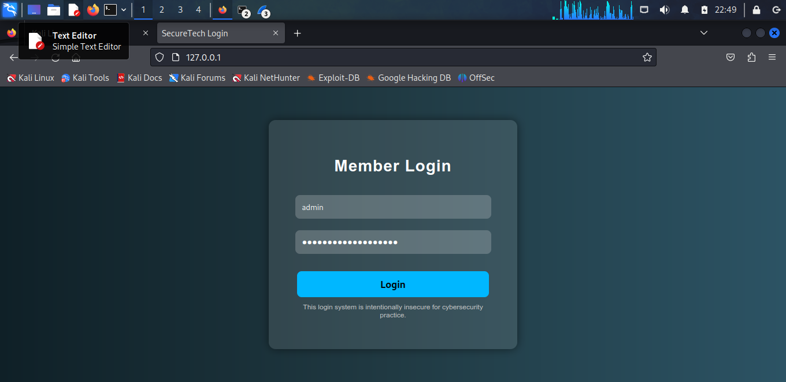
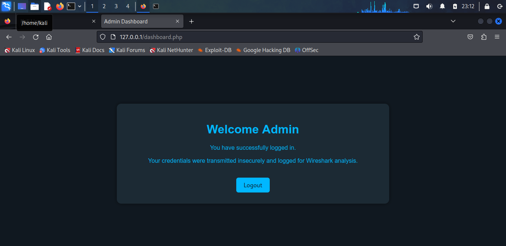
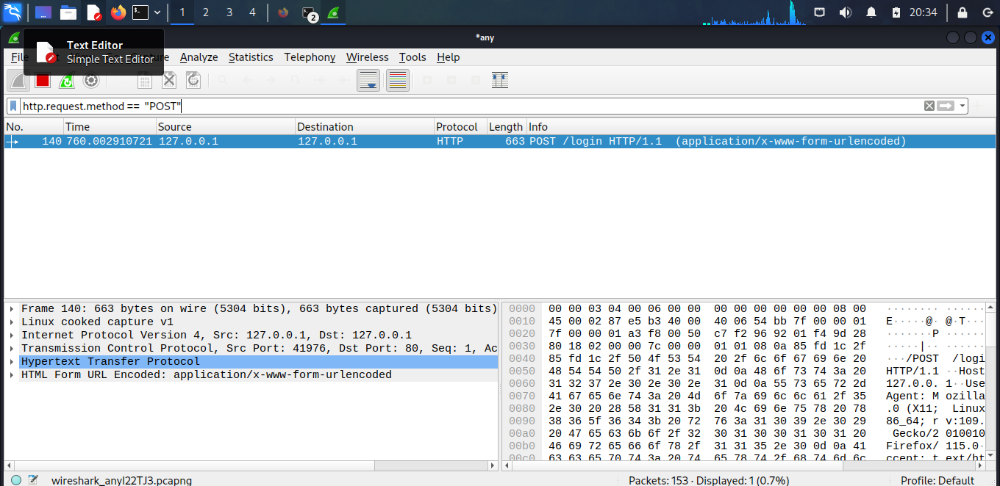
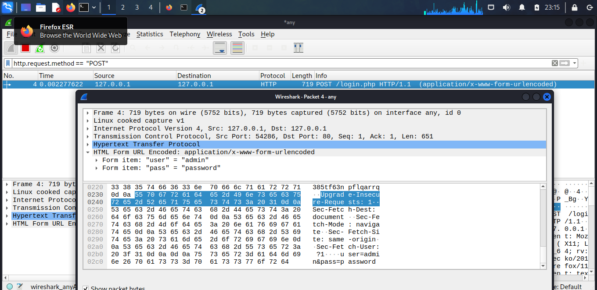
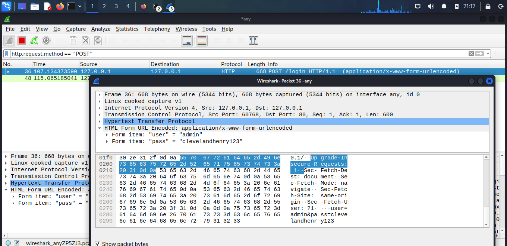
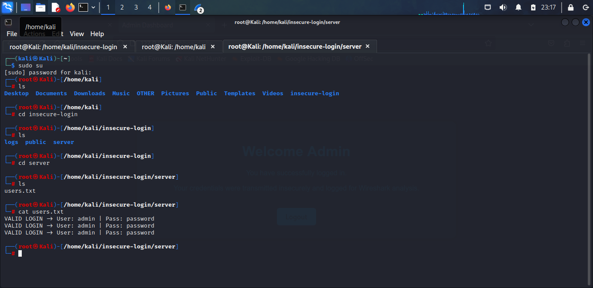
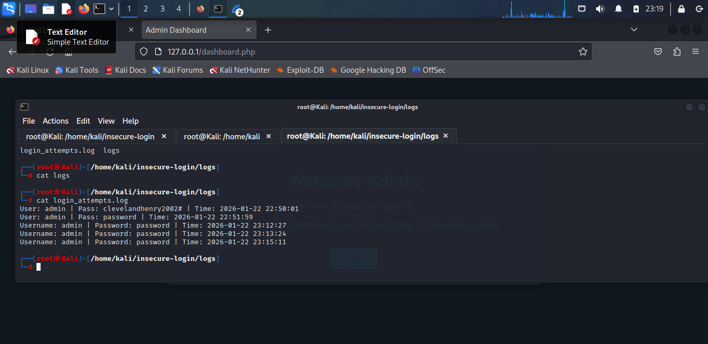

# Unencrypted-login-test

## Capturing and Analysis of Http Credentials

*A cybersecurity project showing how insecure login systems expose user credentials.*

## Project Overview

**This project demonstrates how an insecure login system**:

-Stores credentials in plain text

-Transmits passwords without encryption

-Allows Wireshark interception

-Accepts weak admin credentials

-Logs users without hashing

-Uses no HTTPS


**This is intentionally vulnerable for cybersecurity learning, specifically in**:

-Packet sniffing

-Insecure authentication

-Plain-text storage

-HTTP interception

-Web exploitation fundamentals

**How to Run THis Project (PHP Built-In Server)**

This project helps beginners understand how insecure login forms can leak credentials during trasmission and how attackers analyze them.

This version uses the simplest possible server so as to focus on cybersecurity concepts, not server configuration.

## Project Requirements

**-Software/OS**

       - Kali Linux (VM or Bare Metal)
       
       - Apache2 Web Server
       
       - PHP 8+
       
       - Wireshark
       
       - Browser(Firefox recommended)
       

## Project Directory
project-root/

│── public/

│     ├── index.php

│     ├── login.php

│     ├── dashboard.php

│

│── server/

│     ├── users.txt

│

│── logs/
       ├── login_attempts.log


## Project Workflow
  
1. **Install PHP if missing**

In your Kali Linux machine open the terminal and enter the command:

-`sudo su`- to run as the root, put your Kali password to proceed.

-`apt install php`

2. **Create a directory in /home called insecure-login**

-`mkdir insecure-login`

3. **Move to the insecure-login directory and add these new directories with these files in them**

-`cd insecure-login` - change directory to insecure login


-`mkdir logs public server` - make these directories: logs, public, server.ls

4. **Create these files under `public` directory**       

-`cd public` - change to public directory

**After editing the created files example `nano index.html` press `CTRL + O` then `ENTER` and lasty `CTRL + X` to save the changes.**

-`nano index.html` 
                 - creates the file index.html paste code from index.html in files section  
                 - serves as the main landing page containing the login form where users enter their username and password

-`nano login.php` 
                 - creates another file login.php, paste the code from login.php in files section  
                 - processed login form submissions by checking entered credentials against the stored `users.txt`

-`nano dashboard.php`
                 - creates file dashboard.php, paste code from dashboard.php in files section
                 -displays the protected dashboard page that only logged-in users access after successful authentication

5. **Create the file users.txt under server/**

-`cd ..` - this will move you back to insecure-login directory where server directory is

-`cd server` - this moves you to server directory

-`touch users.txt`
            - this creates the file users.txt
            -it will store the list of valid usernames and hashed passwords for login verification

6. **Create the file login_attempts in logs/**

-`cd ..` - moves you back to insecure-login directory

-`cd logs` - moves you to logs directory

-`touch login_attempts.log`
            - creates a file called login_attempts.log
            - records every login attempt (successful or failed) for monitoring and audit purposes and security analysis

-`cd ..` - moves you back to insecure-login directory

            
7. **Under the directory `insecure-login` we created, enter this command `sudo php -S 0.0.0.0:80 -t public`
*This command starts a built-in **PHP development server that**:*
       -listens on all network interfaces (0.0.0.0)
       -runs on port 80 (default web port)
       -serves files from the `public/` directory
       -uses `sudo` because port 80 requires admin/root privileges

 **It launches your web application so that any device on the same network can access it by visiting your machine's IP address in their browser.**

8. **In your kali terminal, move to a new tab and enter the command `sudo wireshark` to start wireshark**
    
    -Wireshark is used to capture and analyze the insecure HTTP login request
    
    -Launching it with `sudo wireshark` gives Wireshark the required permissions to monitor network interfaces and intercept traffic.
    
    -Once launched, select the active interface (usually `eth0` or `wlan0` or `any`) and start the packet capture before sending a login request

9. **In your browser (firefox), enter this in the address `http://127.0.0.1`**

    -This would help you navigate to the login page below



10. **You can use the credentials `admin` and `password123`**

    -*These are inside `server/login.php` in the `$validUser` and `$validPass` variables*
    -*press `Login` after you enter the credentials to access the `Admin Dashboard below*



11. **Navigate back to wireshark**
    
    -In the filter bar, type: `http.request.method == "POST"` -This shows only HTTP POST requests

    -Look for the request: `POST /login.php`



12. **Click on the packet and expand it (Hypertext Transfer Protocol, HTML Form URL)**

    -You will clearly see: **user = <captured_username>**,  **pass = <captured_password>**

    -This appears in plaintext because the site uses **insecure HTTP, making it easy for attackers or sniffers to steal credentials
    



13. **The `users.txt` file is intentionally insecure and serves as evidence of how vulnerable systems store sensitive information without protection**

    -Everytime a user submits the login form, the credentials are appended to this file in **plain text**, as shown in the screenshot

**What happens behind the scenes: 
-the following code in `server/login.php` writes the captured username and password:  
```
$log = fopen("users.txt", "a");
fwrite($log, "User: $username | Pass: $password\n");
fclose($log);
```
*This demonstrates*:
-credentials are stored without hashing
-any attacker with server access can immediately read them
-this simulates a **real-world insecure credential storage vulnerability**
-Wireshark + this file together shows both: how credentials leak in transit, and at rest

*This file helps demonstrate*
-poor security practices
-why servers must NEVER store raw credentials
-how attackers can escalate privileges after gaining file access




14. **Use these commands to finally navigate to the file `login_attempts.log`**
    -navigate to insecure login directory (you can move to a new tab in the terminal for this)
    -use command `ls` to list directories under `insecure-login`
    - `cd logs` - moves you to the logs directory
    - `ls` - shows the `login_attempts.log` file we created
    - `cat login_attempts.log` -shows the contents of the login attempts that were captured



**The screenshot shows how the system responds differently to valid and invalid credentials.**

*When a user enters the wrong username or password, the script returns:*
`Invalid credentials. Try again`
-This demonstrates: basic authentication logic, how a system handles incorrect logins and what attacker sees when brute-forcing credentials.

*Using the deafault credentials would lead to a successful login*
```
username: admin
password: password123
```
*The system redirects the user to the **dashboard.php** page*

**The login attempts help demostrate: *Brute force feasibility, Credential stuffing scenarios, importance of rare limiting and the importance of strong passwords***

-**A real-world secure system should not reveal whether username or password was incorrect** ("user enumeration mitigation")

-**It should also add lockouts and multifactor authentication**


## Lessons Learned

-How insecure HTTP communication exposes credentials in plaintext

-How Wireshark captures and reconstructs login traffic

-Importance of using HTTPS to protect user data

-Why storing passwords in plaintext (users.txt) is dangerous

-How login logic can be abused through brute force or sniffing

-Why input validation, password hashing, and secure server architecture matter

-Importrance of secure directory structures and proper server configurations 


## Ethical Disclaimer

**The project is intended for educational and cybersecurity awareness purposes only**

**Always practice ethical hacking with legal boundaries**

### Author Information

**Cleveland Henry Lore**
Cybersecurity Enthusiast | Penetration Testing
